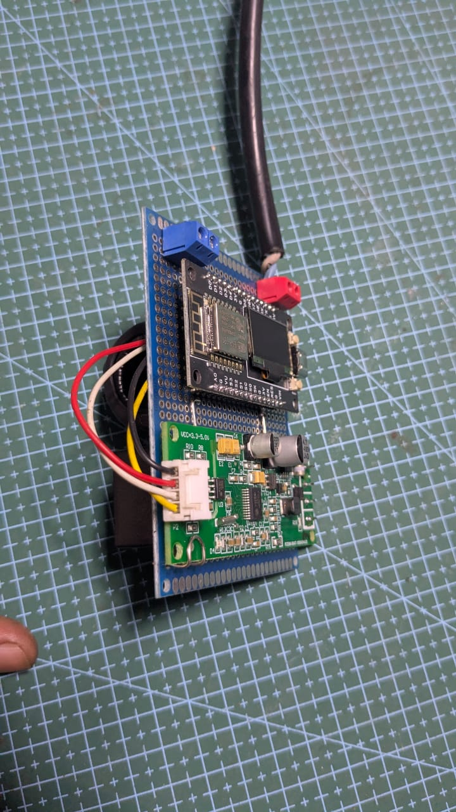
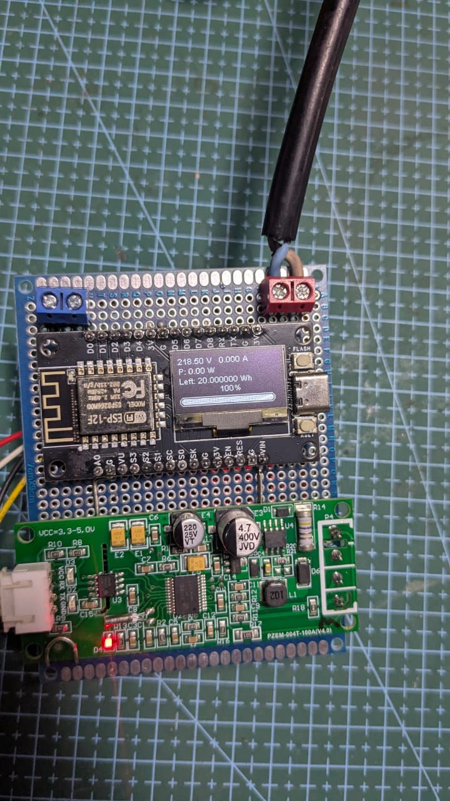

#  Smart Energy Dispenser  
### ESP8266 • PZEM-004T v3 • OLED Display • Web Interface

A compact and efficient energy-management system designed around the ESP8266.  
It measures electrical parameters, displays real-time information on an OLED screen, controls a relay based on available energy, and provides a full-featured web interface for monitoring and administration.

---

## Overview

Smart Energy Dispenser allows the distribution and limitation of electrical energy based on a configurable energy quota.  
The system continuously monitors:

- Voltage (V)  
- Current (A)  
- Power (W)  
- Energy consumption (Wh)

A relay is automatically activated or disabled depending on the remaining energy.  
All data is displayed locally on an OLED and remotely via a WiFi access point hosted by the ESP8266.

---

## Key Features

###  Real-Time Electrical Monitoring
- Uses **PZEM-004T v3** for precise power measurements.  
- Continuous reading of voltage, current, power, and consumed energy.

### OLED Display Interface
- 128x64 SSD1306 display  
- Real-time measurement display  
- Dynamic energy progress bar  
- Styled startup screen

###  Relay Control Logic
- Relay activates when **energyLeft > 0**  
- Automatically switches off when energy is depleted  
- Relay logic: **LOW = ON**, **HIGH = OFF**

###  Integrated WiFi Access Point
- SSID: `system mpd`  
- Password: `123456789`  
- Accessible without external network

###  Web Dashboard
#### User Mode
- Live measurement display  
- Energy left indicator  
- Progress bar visualization

#### Admin Mode
- Add or subtract energy instantly  
- Values update both **energyMax** and **energyLeft**  
- Negative values are prevented  
- Clean HTML/CSS interface

###  EEPROM Data Persistence
- Energy values stored for permanent retention  
- System resumes after power loss without losing state

---

##  Hardware Requirements
- ESP8266 (Wemos D1 Mini recommended)  
- PZEM-004T v3 (UART power monitor)  
- SSD1306 OLED display (I2C)  
- Relay module  
- Proper AC wiring and insulation  

---

##  Pin Configuration (Default)
| Component | Pin |
|----------|-----|
| PZEM RX  | D2  |
| PZEM TX  | D0  |
| OLED SDA | D5  |
| OLED SCL | D6  |
| Relay    | D13 |

---

##  Applications
- Prepaid energy distribution  
- Power-limited charging stations  
- Laboratory test benches  
- IoT-controlled power delivery  
- Smart metering educational projects  

---

##  Author & Credits
- Developed by **Tolojanahary**  
- Co-developed with **Rina**  
- Powered by open-source libraries (PZEM, SSD1306, ESP8266 core)

---

##  License
MIT License — free to use, modify, and integrate.

